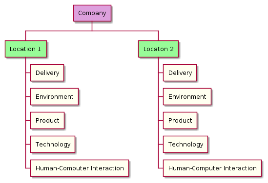

# Organisation Template

## Environment

### Structure

#### Definitions

| Term | Definition |
|--|--|
| Company | A legal entity that provides products and/or services. |
| Product | An item that a consumer is aware of when interacting with something to perform a task. |
| Location | A geographic location where the company has a person or people acting in a role. |
| Function | A problem domain within the organisation that is sufficiently differentiated to require it's own management. |
| Role | A set of responsibilities that define when the associated person is accountable, responsible, needs to be consulted or informed. \[1\] |
| Stream-aligned Team | A group of roles that provide external product experiences on top of internal product ones. \[2\] |
| Platform Team | A group of roles that provide internal product to accelerate delivery by stream-aligned team. \[2\] |
| Enabling Team | A group of roles that help stream-aligned teams overcome obstacles by providing additional capacity or capability. \[2\] |
| Complicated Subsystem Team | A group of roles where the individuals represent a specific niche capability. \[2\] |

\[1\] we use the [The RACI Model](https://racichart.org/the-raci-model/) to define the way a role participates in the completion of a task.

\[2\] we use the nomenclature from [Team Topologies](https://teamtopologies.com/key-concepts) to define team boundaries and interaction modes.

#### Legend

#### Function to Location Distribution

#### Role Distribution

## Engineering

We are using the [ThoughtWorks Radar](https://www.thoughtworks.com/radar/byor) approach for communicating the languages, tools, platforms and frameworks sensible defaults within the organisation.

The content is in the [engineering-radar.csv](engineering-radar.csv) file.

You can build the radar image locally using the following command: `./bin/build-engineering-sensible-defaults-radar`

## Architecture

We are using the [ThoughtWorks Radar](https://www.thoughtworks.com/radar/byor) approach for communicating the patterns, practices, methodologies and ceremonies sensible defaults within the organisation.

The content is in the [architecture-radar.csv](architecture-radar.csv) file.

You can build the radar image locally using the following command: `./bin/build-architecture-sensible-defaults-radar`

## How We Work

We use:

* [The RACI Model](https://racichart.org/the-raci-model/) to define the way a role participates in the completion of a task.
* [RAID Analysis](https://www.techagilist.com/agile/scrum/raid/) to document risks, assumptions, issues and dependencies when planning.
* [RAPID Model](https://www.bain.com/insights/rapid-tool-to-clarify-decision-accountability/) to clarify who does what in the decision making process.
* [Architecture Decision Records](https://cognitect.com/blog/2011/11/15/documenting-architecture-decisions) to capture the data and rhetoric used to make our decisions.

### Our Risks, Assumptions, Issues and Dependencies

| Description | Type | Criticality |
|--|--|--|
| Decisions made without all the required interactions/information | Risk | High |

#### Proposed Mitigation

| Description | Mitigation |
|--|--|
| We want to be making good decisions | [0001-we-want-to-be-making-good-decisions.md](decisions/0001-we-want-to-be-making-good-decisions.md) |

## Our Technology Entropy Management

### Use Sensible Defaults

Capture sensible defaults for technology (languages, frameworks, tools and platforms) and architecture (patterns, practices, methodologies and ceremonies). These help guide teams to acceptable decisions on code, quality, software delivery approaches and architectural management, while still maintaining a degree of autonomy.

### Use Automation

Automate what we can to minimise bottlenecks in software development, delivery and project on-boarding. Examples of automation we expect from our teams are: tests, developer experiences, convention tests, infrastructure and continuous delivery.

### Use Machine Readable Specifications

Use standardised machine readable and structured specifications to document. As an example, we expect our teams to use: Architectural Decision Records (ADR), PlantUML and the Descriptor Format for Catalogue Entities used in Spotify Backstage for system cataloguing.

### Use Standard Processes

Use standard processes for documenting aspects of the software delivery process. As an example we expect our teams to use: RAID Analysis to document risks, assumptions, issues and dependencies; the RAPID Model to clarify who does what in the decision making process; and the RACI Model to define the way roles participate in the completion of a task.

### Use Contracts For Team Inputs And Outputs

Use consistent metrics as a contract for all our teams to report on e.g. software delivery performance using the DORA metrics. The metrics we use and the way we report on them can be aggregated so we can automate reporting at more coarse grained granularities.

### Measure How We Are Doing

Measure what we care about so we can favour data over rhetoric when making decisions and discussing our progress. Examples we expect our teams to use are the DORA metrics, Real User Monitoring (RUM) for e.g. performance, and analytics measures such as Daily Active Users (DAU).

## Our Software Development and Delivery Management

### Give Autonomy Over Giving The Approach

Teams develop and deliver using a combination of approaches they identify as suitable given the Problems, Opportunities, Objectives and Constraints of the team. The approach is to “trust, but verify”, through tracking whether the team is an Elite, High, Medium or Low performer based on the DORA Metrics: Lead Time to Changes (LTTC), Deployment Frequency (DF), Mean Time To Recovery (MTTR) and Change Failure Rate (CFR).

### Give Objectives To Achieve Over Solutions To Be Implemented

Teams are provided objectives representing problems to be solved for our customers or the business. The team is tasked with:

* documenting Architectural Decision Records with initiative options to achieve the objective
* proposing key results they have identified as achievable

### Use Automation over Manual Activity

Teams are to avoid manual activities and ruthlessly automate. Determining whether a team has an appropriate amount of automation is achieved via chaos engineering in their product infrastructure, and monitoring DORA Metrics to measure the team and on-boarding performance: Lead Time to Changes (LTTC), Deployment Frequency (DF), Mean Time To Recovery (MTTR) and Change Failure Rate (CFR).

### Use Consistent Reporting Formats over Inconsistent Ones

Teams are to report on e.g. Objectives and Key Result progress using a format that is consistent between them. This provides the leadership team with a ubiquitous language and reduces cognitive load.

## Our Technical Debt Management

### Deliberate

Maintain a register of decisions that deliberately incur debt. This is a table that has columns for: ‘Date’, ‘Repay By Date’, ‘Description’, ‘Justification’, ‘Estimated Effort’ and ‘Link to Related Architectural Decision Record’.

### Bit Rot

Development teams are required to create Architectural Decision Records (ADR) to avoid their products devolving into unnecessary complexity and/or suffering design drift. A team makes a recommendation, adjacent product teams and technology leaders need to agree, the team will perform any updates to their projects and/or processes, input will be sought from the technology function in the business, and the decision on the approaches to be utilised will be made by the team Technology Manager.

### Outdated Design

Quarterly review. The Purpose, Outcomes, Decisions and Structure (PODS):

#### Purpose

To identify decisions or system characteristics that are no longer desirable/fit-for-purpose.

#### Outcomes

* Set of problem statements with RAPID assignments (Recommend, Agree, Perform, Input and Decide) that provide context on the problem manifest by the debt identified.
* Updates to the engineering radar (additions, subtractions and ring changes)
* Updates to the architecture radar (additions, subtractions and ring changes)

#### Decisions

* What technical characteristics identified in the architectural decision register and system catalogue have become undesirable?
* What technologies should be added, subtracted or change rings in the engineering sensible defaults radar?
* What architectural approaches should be added, subtracted or change rings in the architecture sensible defaults radar?
* Who is going to Recommend a solution, needs to agree to it, will perform any changes, needs to provide input and who makes the decision on the solution to be enacted to pay off any identified debt?

#### Structure

* Review decision register
* Review system catalogue
* Review engineering sensible defaults radar
* Review architecture sensible defaults radar

## Our Cost Management

### Cost Of Goods Sold (COGS)

* Infrastructure costs
* Third-party platform costs for internal and external products
* Third-party library costs for components embedded in internal and external products
* Front office costs for sales, account management and customer support people, products and platforms
* Back office costs for analysis, technical, and administrative support people, products and platforms
* Product development and delivery people, products and  platforms

### Profitability

* We use Average Revenue Per User (ARPU) to measure our commercial health on a monthly cadence:
  * `Total Revenue / Number of Users`
* We use Customer Lifetime Value (LTV) to measure our per customer profitability:
  * `ARPU x Average Months User is Active – COGS`
* We use a standard account method to measure our overall profitability:
  * `Revenue – COGS – Expenses`

## Our Incident Management

* We use a “You build it, you run it” approach for our products
* We use operational support rosters within our product teams to determine the team members responsible when an incident occurs

The table below defines who is responsible, accountable, needs to be consulted or informed in our Incident Management and Operational Support process.

| Role  | Responsible?  | Accountable?  | Consulted?  | Informed?  |
|---|---|---|---|---|
| Chief Information Officer |   |   |   | `Y` |
| Delivery Manager \[1\] |   | `Y`  |   |   |
| Chief Product Officer |   |   |   | `Y` |
| Product Manager \[1\] |   |   | `Y` |   |
| Chief Technology Officer |   |   |   | `Y` |
| Technology Manager \[1\] |   |   | `Y` |   |
| Chief Creative Officer |   |   |   | `Y` |
| Design Manager \[1\] |   |   | `Y` |   |
| Stream-aligned Team \[2\] | `Y` |   |   |   |
| Platform Team \[2\] | `Y` |   |   |   |
| Enabling Team \[2\] | `Y` |   |   |   |
| Complicated Subsystem Team \[2\] | `Y` |   |   |   |

\[1\] managers involved in incident determined by products affected.

\[2\] teams involved in incident determined by accountable role and system catalogue consultation.

## Links

* [Summary Presentation](https://docs.google.com/presentation/d/1jPQLlfglIwNaouPC94LcN0ZQgPY535Ah9nWuxWScuOk/edit?usp=sharing)
* [Architecture Decision Register](decisions)
